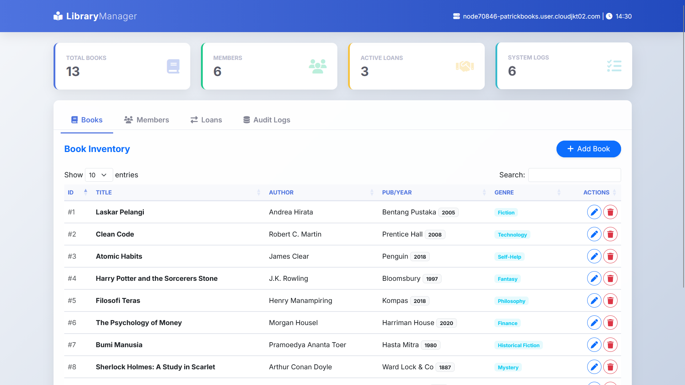
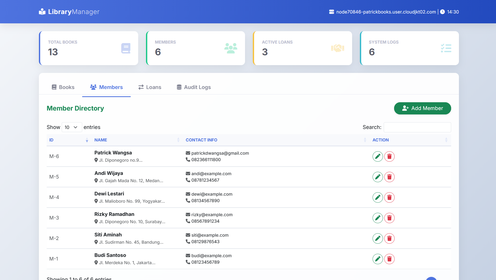
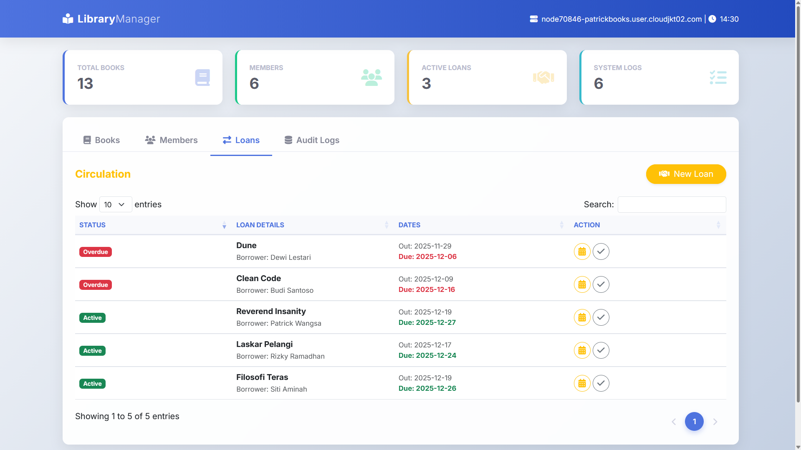
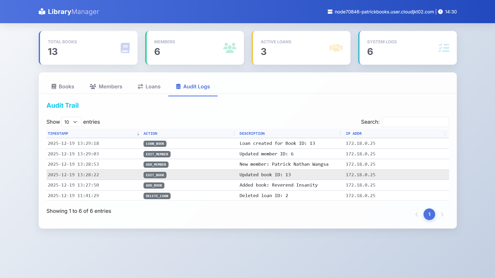

# 📚 Secure Hybrid Library Management System (Cloud Native)


A comprehensive Fullstack Library Management System deployed on Cloud Infrastructure. This project demonstrates the **Polyglot Persistence** architecture by utilizing **MariaDB (SQL)** for transactional data and **MongoDB (NoSQL)** for high-volume audit logging.

🔗 **Video Demo:** [video](https://youtu.be/FKS1l4GORtM)  

---

## 🚀 Key Features

### 🛡️ Hybrid Database Architecture
- **MariaDB (Relational):** Manages structured data with strict integrity constraints (ACID) for Books, Members, and Loan transactions.
- **MongoDB (Document Store):** Handles high-speed, immutable write operations for **Activity Logs** (Audit Trail). Every action (Add, Edit, Delete) is logged in real-time.

### 💻 Application Features
- **Book Inventory:** CRUD operations with validation.
- **Member Management:** Registration and management of library members.
- **Circulation System:**
  - Loan recording with automatic stock validation.
  - Due date calculation.
  - Prevention of double-booking.
- **Real-time Audit Log:** View system activities fetched directly from MongoDB.
- **Modern UI/UX:** Built with Bootstrap 5 and DataTables for instant searching, sorting, and pagination.
- **Security:** CSRF Protection, Input Sanitization, and XSS Prevention.

---

## 📸 Screenshots

### 📖 Book Inventory (DataTables)
Manage books with instant search and sorting capabilities.


### 👥 Member Management
Directory of registered library members.


### 🤝 Loan Transactions
Track active loans and overdue items with visual status indicators.


### 🛡️ Real-time Audit Logs (MongoDB)
Immutable activity history fetched directly from the NoSQL database.


---

## ☁️ Cloud Architecture (Dewa Cloud)

This application is deployed using a containerized topology:
1.  **Application Server:** Apache PHP (Handling Application Logic)
2.  **SQL Node:** MariaDB 10.x (Storing relational data)
3.  **NoSQL Node:** MongoDB 6.x (Storing activity streams)

---

## 🛠️ Installation & Setup

### Prerequisites
- PHP 8.0 or higher
- MariaDB / MySQL
- MongoDB Server
- PHP Extensions: `pdo_mysql`, `mongodb`

### 1. Clone the Repository
```bash
git clone [https://github.com/USERNAME/REPO-NAME.git](https://github.com/USERNAME/REPO-NAME.git)
cd REPO-NAME
